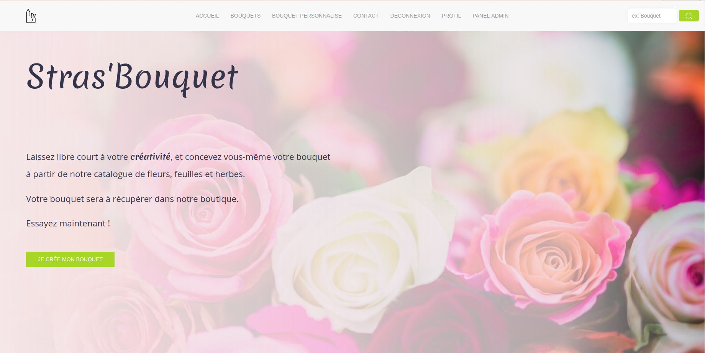
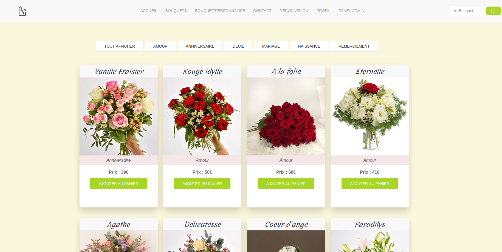
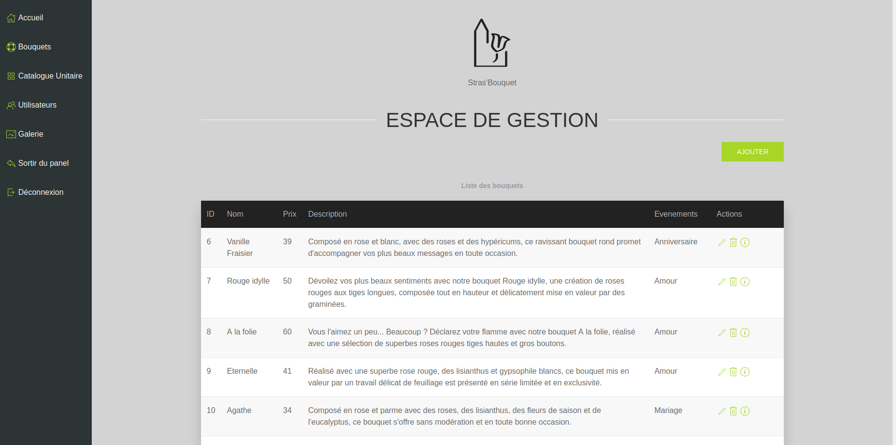

# Strasbouquet - Projet 2 WCS 2020

## Description
Projet réalisé dans le cadre de la formation PHP Développeur Web à la Wild code school pendant 5 semaines.  
Réalisation d'un site fictif pour un fleuriste Strasbourgeois n'ayant aucune présence sur internet, et n'ayant aucune idée de palette ou de design pour son site.  
Cahier des charges non fournis.

## Equipe

 - LeadDev : Typhaine (https://github.com/karapuce)
 - Backend Developper & Designer : Yann (https://gist.github.com/mozbiat)
 - Backend Developper : Franck (https://github.com/Jeffo7980)
 - Backend Developper & réalisation du logo : Pierre (https://github.com/kiw808)

### Etapes

Premier projet en PHP avec twig, réalisé de avril à mai 2020. 
   
 -> Edition d'un Product Backlog  
 -> Réalisation d'un wireframe  
 -> Conception de la base de données  
 -> Utilisation de la méthode agile  
 -> Réalisation du CRUD  
 -> Séparation back-office et front-office  
 -> Système d'authentification avec hash_password  
 -> Gestion des sessions et du panier
 -> Filtrage des produits
 -> Ajout des pages fixes
 -> Finitions du site

### Petit aperçu du site

>L'accueil lorsque l'on arrive sur le site 
   
>Le rendu des bouquets dans l'onglet dédié, avec des filtres par thèmes 
   
>La vue et gestion des produits côté administrateur 

### Langages & outils utilisés

<ul>
    <li>PHP</li>
    <li>Jquery</li>
    <li>Twig</li>
    <li>Uikit</li>
    <li>Trello</li>
    <li>Draw.io</li>
    <li>Travis</li>
    <li>GrumPhp</li>
</ul>
